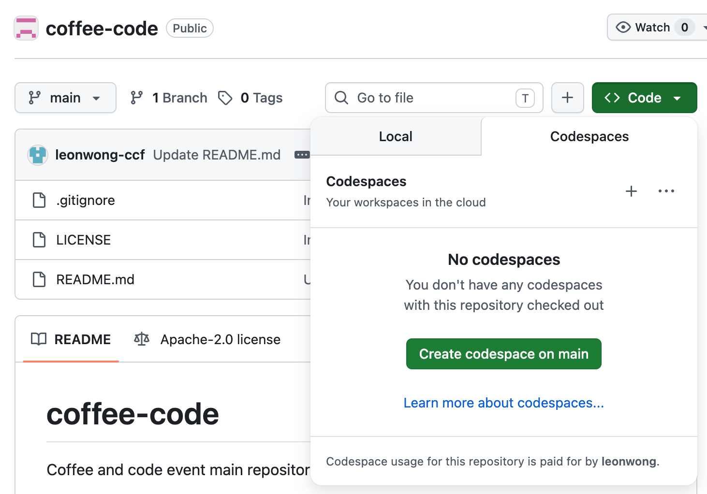

# coffee-code
Coffee and code event main repository

--- 
## Pre-Work

1. Create an account on github.com if you don't already have one
2. Send your github username to leon@centerforcivicfutures.org
3. Make sure you can access []()

---
## Working with GitHub Codespaces

1. Navigate to https://github.com/CCF-AI-Officers-Summit-2026/coffee-code
2. Click on _Create Codespace on main_ to create a cloud-based development environment. 


3. Install your favorite AI coding assistant
4. Shut down your codespace when you aren't using it.
5. Manage your codespaces or return to a paused instance [here](https://github.com/codespaces)

---

## 🧑‍💻 Working with GitHub

### 🔁 1. Get the latest code (sync your repo)

```bash
git pull origin main
```

* Makes sure you have the newest version of the project
* Run this **before starting any work**

---

### 🌿 2. Create a new branch for your work

```bash
git checkout -b my-feature-name
```

* Always work on a branch (not `main`)
* Use descriptive names:

  * `fix-login-bug`
  * `add-chat-feature`

---

### ✏️ 3. Make changes

* Edit files in your editor (VS Code, Codespaces, etc.)
* Save your work

---

### 📌 4. Stage changes

```bash
git add .
```

* Prepares your changes for commit
* `.` = add all changed files

---

### 💬 5. Commit changes to your local repo

```bash
git commit -m "Add feature: basic AI agent loop"
```

* Write a clear message:

  * What did you change?
  * Why?

---

### ⬆️ 6. Push changes to GitHub

```bash
git push origin my-feature-name
```

* Uploads your branch to GitHub

---

### 🔀 7. Create a pull request (PR)

On GitHub:

1. Go to your repo
2. Click **“Compare & pull request”**
3. Add a title + description
4. Click **“Create pull request”**

---

### 👀 8. Review and merge

* Teammates review your code
* Once approved → click **Merge**

---

### 🔄 9. Update Your local main

After merge:

```bash
git checkout main
git pull origin main
```

---

## ⚡ Quick Daily Workflow

```bash
git checkout main
git pull origin main
git checkout -b my-branch

# make changes

git add .
git commit -m "your message"
git push origin my-branch
```

---

### 🧠 Tips

* ✅ Pull often to avoid conflicts
* ✅ Keep PRs small and focused
* ✅ Use clear commit messages
* ❌ Don’t work directly on `main`
* ❌ Don’t forget to push your branch

---

### 🆘 Common Fixes

#### Undo last commit (keep changes)

```bash
git reset --soft HEAD~1
```

#### Check current status

```bash
git status
```

#### See branches

```bash
git branch
```
---

## Useful Resources

* [mcp-proxy](https://github.com/sparfenyuk/mcp-proxy) to convert between stdio and http protocols for MCP server access.
